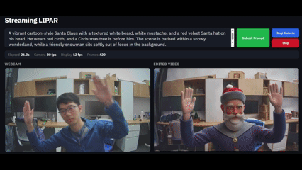

<h1 align="center">Streaming Latent Inter-frame Pruning with Attention Recovery (Streaming LIPAR)</h1>

<p align="center">
  <a href="https://sites.google.com/utexas.edu/dennismenn/about">Dennis Menn</a><sup>1</sup> ·
  <a href="https://scholar.google.com/citations?user=p4pjbpsAAAAJ&hl=en">Yuedong Yang</a><sup>1</sup> ·
  <a href="https://bokun-wang.github.io/">Bokun Wang</a><sup>1</sup> ·
  <a href="https://xiwenwei.github.io/">Xiwen Wei</a><sup>1</sup> ·
  <a href="https://www.linkedin.com/in/mustafa-munir-02408/">Mustafa Munir</a><sup>1</sup> ·
  <a href="https://jeff-liangf.github.io/">Feng Liang</a><sup>2</sup> ·
  <a href="https://www.ece.utexas.edu/people/faculty/radu-marculescu">Radu Marculescu</a><sup>1</sup> ·
  <a href="https://www.chenfengx.com/">Chenfeng Xu</a><sup>1</sup> ·
  <a href="https://www.ece.utexas.edu/people/faculty/diana-marculescu">Diana Marculescu</a><sup>1</sup>
</p>

<p align="center">
  <sup>1</sup>The University of Texas at Austin &nbsp;&nbsp; <sup>2</sup>Meta GenAI
</p>

<p align="center">
  <a href="https://arxiv.org/abs/2603.05811">Arxiv</a> | <a href="https://dennismenn.github.io/lipar/">Webpage</a>
</p>

---

## Overview

<table align="center" width="600">
  <tr>
    <td colspan="2" align="center">
      <a href="docs/static/images/comparisons/edited.mp4">
        
      </a>
    </td>
  </tr>
</table>

Latent Inter-frame Pruning with Attention Recovery (LIPAR) is a **training-free** acceleration framework for conditioned video generation using diffusion transformers. It exploits temporal redundancy in latent features to avoid re-editing unchanged patches while preserving visual quality through an **Attention Recovery** mechanism.

LIPAR consists of three key components:
1. **Latent Inter-frame Pruning**: Prune unchanged latent patches.
2. **Attention Recovery**: Reduce train-inference mismatch caused by pruning.
3. **Restoration**: Recover full latent dimensions after denoising for decoding.

> **Note:** **Streaming LIPAR** is a separate work that extends LIPAR for real-time video editing. For the original LIPAR paper, see the `lipar` branch.

Empirically, Streaming LIPAR improves average video editing throughput by **~2×** and can achieve up to 20 FPS for FP16 4-step Self-Forcing model.

## Requirements
- NVIDIA GPU with at least 18GB memory (RTX 4090, A6000 tested)
- Linux
- 32GB RAM

Insufficient RAM can be supplemented with a swap file. Other hardware may work but is not officially tested.

## Installation

Install CUDA 12.8:
1. Download CUDA 12.8 from NVIDIA: https://developer.nvidia.com/cuda-12-8-0-download-archive
2. Add to `~/.bashrc`:

```bash
export PATH=/usr/local/cuda-12.8/bin:$PATH
export LD_LIBRARY_PATH=/usr/local/cuda-12.8/lib64:$LD_LIBRARY_PATH
```

Create environment and install dependencies:

```bash
conda create -n lipar python=3.10 -y
conda activate lipar
pip install -r requirements.txt
pip install flash-attn --no-build-isolation
python setup.py develop
```

## Quick Start

### 1) Download checkpoints

```bash
hf download Wan-AI/Wan2.1-T2V-1.3B --local-dir wan_models/Wan2.1-T2V-1.3B
hf download gdhe17/Self-Forcing checkpoints/self_forcing_dmd.pt --local-dir .
```

### 2) Run real-time video editing

```bash
python3 demo.py
```


**Notes:**
- Long, detailed prompts generally perform better.
- TAE weights are from [taehv](https://github.com/madebyollin/taehv).

---

## Important Files for LIPAR

- `demo.py`: main video editing loop
- `src/wan/modules/causal_model.py`: causal diffusion transformer with Attention Recovery
- `src/utils/rlt_prune.py`: Latent Inter-frame pruning and token restoration utilities
- `src/pipeline/causal_inference.py`: denoising loop and cache orchestration
- `src/utils/wan_wrapper.py`: per-step model wrapper logic

---

## Acknowledgements

This codebase is built on top of:
- [CausVid](https://github.com/tianweiy/CausVid)
- [Wan2.1](https://github.com/Wan-Video/Wan2.1)
- [Self-Forcing](https://github.com/guandeh17/Self-Forcing)

## Citation

If you find this repository useful, please cite the paper.

```
@article{menn2026trainingfreelatentinterframepruning,
  title={Training-free Latent Inter-Frame Pruning with Attention Recovery},
  author={Dennis Menn and Yuedong Yang and Bokun Wang and Xiwen Wei and Mustafa Munir and Feng Liang and Radu Marculescu and Chenfeng Xu and Diana Marculescu},
  journal={arXiv preprint arXiv:2603.05811},
  year={2026}
}
```